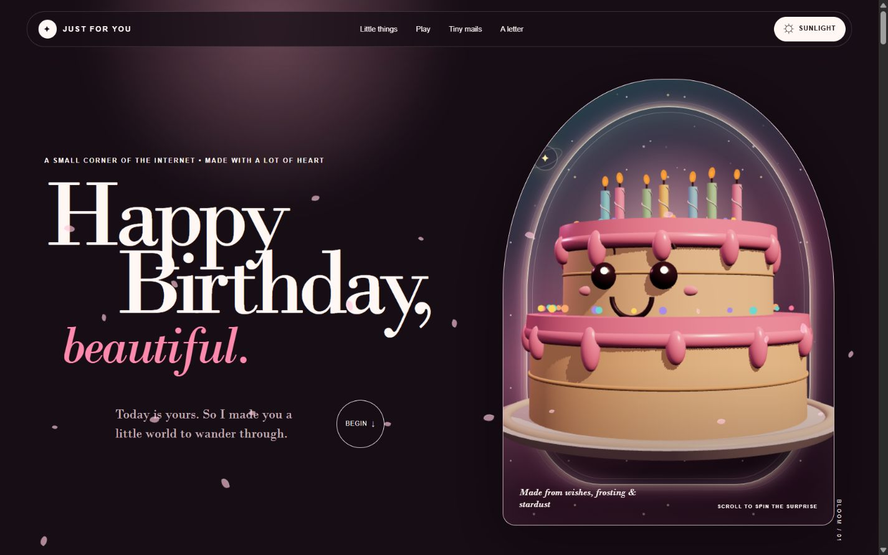
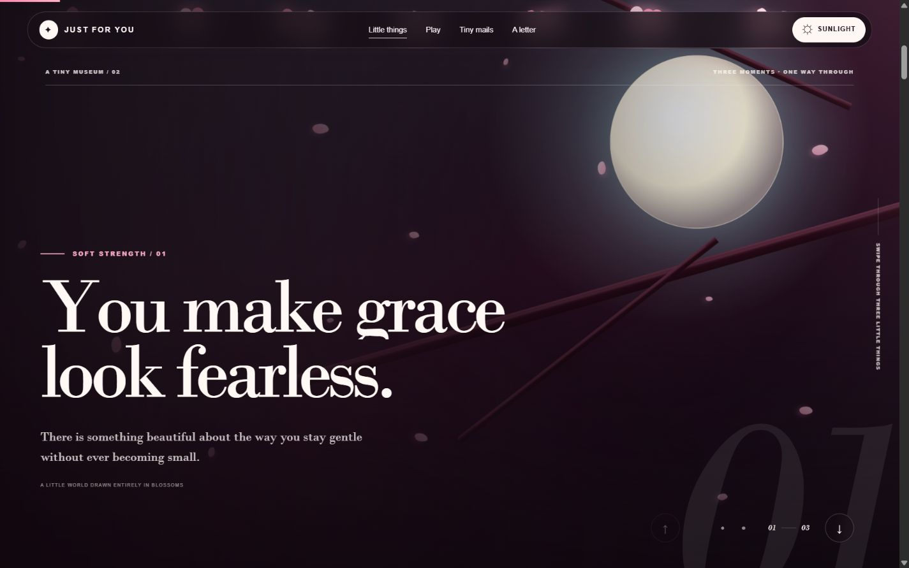
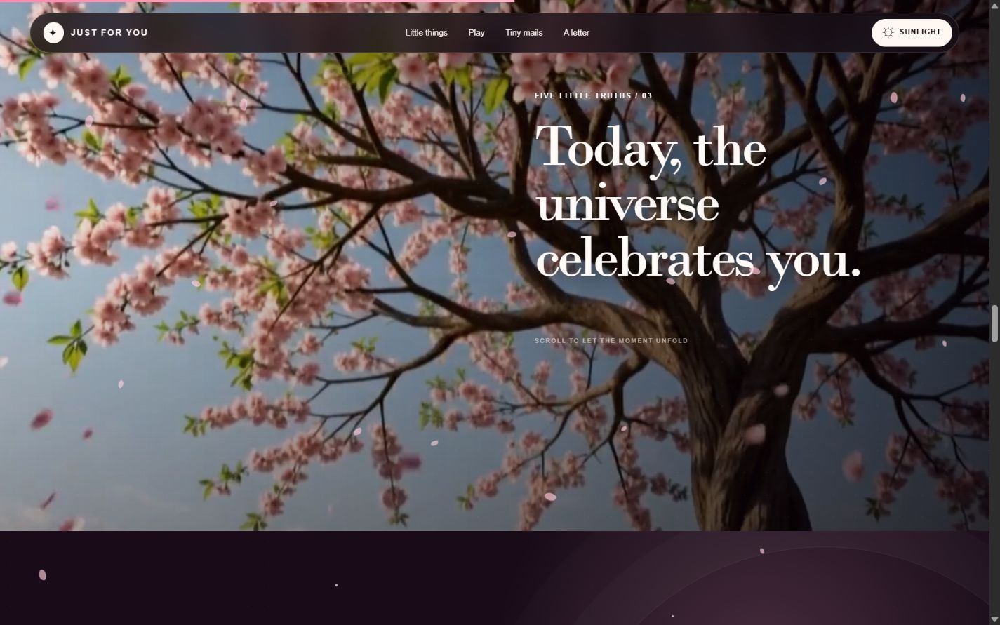
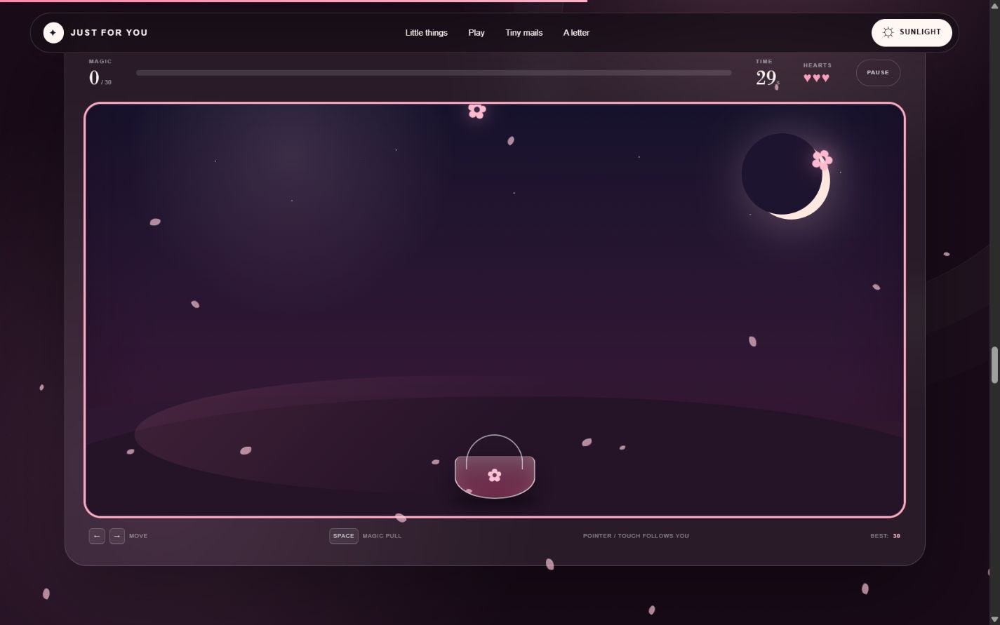
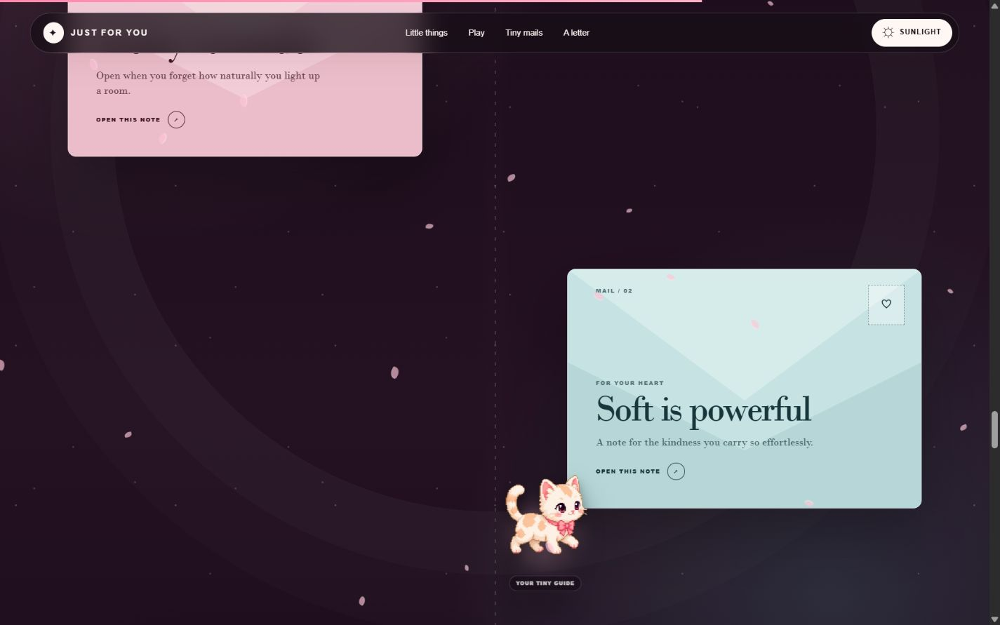

<div align="center">



# Bday Wish

### An interactive birthday world, made with blossoms, motion and a lot of heart.

[](https://just-to-make-you-feel-special.vercel.app/)
[](https://github.com/Hey-Rathiii/Bday-Wish/stargazers)


</div>

---

## A little world to wander through

This is not a regular birthday card. It is a cinematic, responsive experience where a code-built cake reacts to the visitor, blossom scenes move with every gesture, a real video unfolds through scroll, a tiny kitten carries secret notes, and the final wish arrives with its own celebration.

> Best experienced slowly, with a little curiosity. Every section hides a small surprise.

## Live preview

### A birthday cake built entirely in code

The hero is a real-time React Three Fiber scene with animated candles, frosting, sprinkles, lighting and scroll-reactive movement — not a static cake image.

<table>
  <tr>
    <td width="50%" valign="top">
      
      <br />
      <sub><b>Finite blossom story</b> — three moments, one deliberate way through.</sub>
    </td>
    <td width="50%" valign="top">
      
      <br />
      <sub><b>Five birthday truths</b> — a cinematic tree film scrubbed by scroll.</sub>
    </td>
  </tr>
  <tr>
    <td width="50%" valign="top">
      
      <br />
      <sub><b>Blossom Rush</b> — 30 seconds to catch petals, hearts and stardust.</sub>
    </td>
    <td width="50%" valign="top">
      
      <br />
      <sub><b>The tiny guide</b> — a pixel kitten travels between four secret mails.</sub>
    </td>
  </tr>
</table>

## What is inside

| Moment | Experience |
|---|---|
| 🎂 **The cake portal** | A procedural 3D two-tier cake with candles, frosting, face, sprinkles, lighting, pointer response and scroll motion. |
| 🌸 **The blossom story** | A finite three-panel GSAP journey powered by Observer, ScrollTrigger and SplitText-style heading motion. |
| 🌳 **Five little truths** | A full-screen cherry-blossom film whose frames and five messages are synchronized to scroll. |
| ✨ **Blossom Rush** | A 30-second pointer, touch and keyboard mini-game with hearts, magic, pause/replay and a saved best score. |
| 🐱 **Four tiny mails** | A pixel kitten follows GSAP Flip waypoints between four interactive birthday notes. |
| ☀️ **Sunlight / moonlight** | A persisted light-and-dark theme changes the mood without losing the visual identity. |
| 💌 **The sealed letter** | A private-feeling modal letter placed near the end of the journey. |
| 🕯️ **The final wish** | Blow out the candles, release the confetti and reveal the closing birthday message. |

## The latest upgrade

- Added the scroll-reactive 3D cake hero and a graceful non-WebGL fallback.
- Added the finite GSAP blossom story immediately after the hero.
- Replaced the old promise scene with a real cherry-blossom video scrubbed through five truths.
- Added the pixel-kitten mail journey and four interactive envelopes.
- Added smarter viewport-aware WebGL activity and video preparation.
- Smoothed the hero-to-story handoff, fast panel gestures and off-screen animation work.
- Added reduced-motion paths, keyboard controls and responsive compositions for phones through wide desktops.

## Motion architecture

```text
Scroll / touch / pointer
          │
          ├── Lenis ─────────────── smooth page movement
          ├── GSAP ScrollTrigger ─ pinned stories + video scrub
          ├── GSAP Observer ─────── finite swipe navigation
          ├── GSAP Flip ─────────── kitten waypoint travel
          └── React Three Fiber ─── real-time birthday cake
```

| Layer | Tools |
|---|---|
| Framework | Next.js 16, React 19, TypeScript |
| 3D | Three.js, React Three Fiber, Drei |
| Motion | GSAP, ScrollTrigger, Observer, Flip, Lenis |
| Styling | Handcrafted responsive CSS, CSS variables, dark/light themes |
| Delivery | Vercel, optimized production build |

## Project map

```text
app/
├── BirthdayExperience.tsx   # Page orchestration, Lenis, truths, letter and wish
├── CakeHero.tsx             # Cake visibility, scroll progress and fallback
├── CakeScene.tsx            # Procedural React Three Fiber cake
├── SwipeStory.tsx           # Finite three-panel GSAP story
├── BlossomRush.tsx          # Birthday mini-game
├── CatMailJourney.tsx       # Flip waypoints and interactive notes
├── CatTravellerScene.tsx    # Pixel kitten guide
├── birthday.css             # Themes, responsive art direction and motion
├── layout.tsx
└── page.tsx

public/
├── birthday-tree-scroll-scrub.mp4
├── pixel-kitten.png
└── readme/                  # Live production screenshots
```

## Run it locally

```bash
git clone https://github.com/Hey-Rathiii/Bday-Wish.git
cd Bday-Wish
npm install
npm run dev
```

Open [http://localhost:3000](http://localhost:3000), then scroll slowly.

```bash
npm run build
npm run lint
```

## Built with care

- Responsive layouts for desktop, tablet and mobile.
- Keyboard, touch and pointer support in interactive moments.
- Reduced-motion alternatives for visitors who prefer less animation.
- Decorative visuals are kept outside the accessibility tree where appropriate.
- Heavy scenes pause or prepare based on viewport visibility to keep the journey smooth.

---

<div align="center">

### Ready to enter the little world?

[**Open the birthday experience →**](https://just-to-make-you-feel-special.vercel.app/)

If this project made you smile, leave it a ⭐ — it means a lot.

<sub>Made with care, petals and a little stardust.</sub>

</div>
