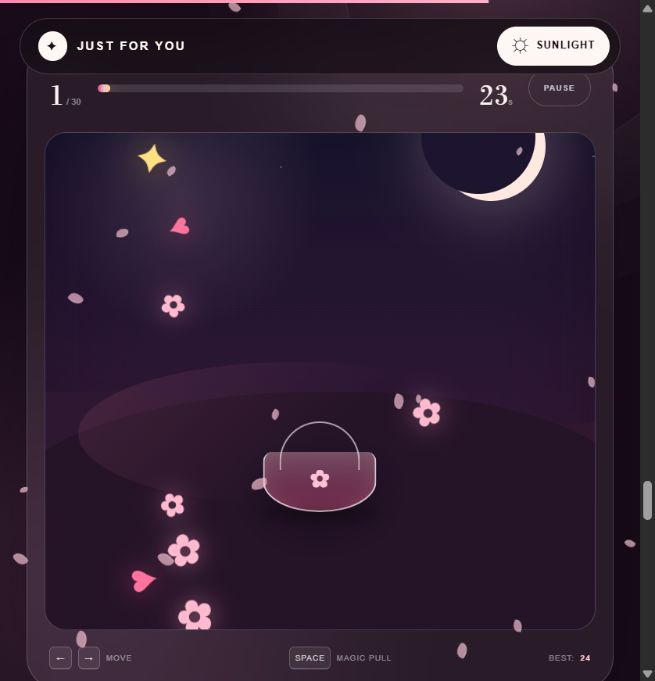

<div align="center">


<br />

# 🌸 Bday Wish 🌸

### A little digital world made to help someone special feel truly celebrated.

<p>
  Cinematic blossoms · Smooth storytelling · Magical surprises · Made with love
</p>

<a href="https://just-to-make-you-feel-special.vercel.app">
  
</a>

<br /><br />


</div>

---

## 🎮 New surprise: Blossom Rush

<div align="center">



### Catch the blossoms. Dodge the clouds. Fill the garden with magic.

</div>

Blossom Rush is a 30-second birthday mini-game woven directly into the story. Guide the moonlit basket with a mouse, touchscreen, or keyboard and reach **30 magic points** before time runs out.

| Treasure | Magic | Effect |
|:---:|:---:|---|
| ✿ | `+1` | A soft pink blossom |
| ♥ | `+2` | A little extra love |
| ✦ | `+5` | A rare golden blossom |
| ☁ | `-1 heart` | A storm cloud to avoid |

The game includes pause and replay controls, a saved local high score, responsive touch controls, keyboard support, and a secret victory wish.

---

## 💌 The experience

This is more than a birthday card. It is an interactive, scroll-driven story filled with soft light, cherry blossoms, warm wishes, and small surprises waiting to be discovered.

| | Moment | What happens |
|:---:|---|---|
| 🎮 | **Blossom Rush** | A 30-second flower-catching game unlocks a secret victory wish |
| 🌸 | **Blossom journey** | Floating petals and layered scenery move with the page |
| 🕯️ | **Birthday magic** | An animated cake, candles, wishes, and confetti come alive |
| 💌 | **Secret letter** | A personal birthday message opens through an interactive reveal |
| 🖼️ | **Memory gallery** | Photographs appear with soft, cinematic transitions |
| 🌙 | **Midnight garden** | Switch between luminous light and dreamy dark themes |
| ✨ | **Hidden surprises** | Little interactions reward curiosity throughout the experience |

## 🎬 Motion and details

- **Lenis smooth scrolling** for a calm, premium feel
- **GSAP + ScrollTrigger** for pinned scenes and scroll choreography
- Layered **parallax depth** across blossoms, light, and typography
- Custom CSS particles, glow, confetti, candle, and reveal animations
- Responsive composition for mobile, tablet, and desktop
- Reduced-motion support for a more accessible experience

## 🛠️ Made with

| Technology | Role |
|---|---|
| ▲ **Next.js 16** | Application framework and production rendering |
| ⚛️ **React 19** | Interactive experience and component architecture |
| 🔷 **TypeScript** | Type-safe, maintainable UI logic |
| 🟢 **GSAP** | Timeline and scroll-linked animation |
| 〰️ **Lenis** | Smooth scrolling and motion coordination |
| 🎨 **Custom CSS** | Art direction, themes, responsive layout, and effects |
| 🔺 **Vercel** | Production hosting, HTTPS, and global delivery |

## 🚀 Run it locally

### 1. Clone the repository

```bash
git clone https://github.com/Hey-Rathiii/Bday-Wish.git
cd Bday-Wish
```

### 2. Install and start

```bash
npm install
npm run dev
```

Open **[http://localhost:3000](http://localhost:3000)** in your browser.

### 3. Create a production build

```bash
npm run build
npm start
```

## 🗂️ Project map

```text
Bday-Wish/
├── app/
│   ├── BlossomRush.tsx          # Interactive birthday mini-game
│   ├── BirthdayExperience.tsx   # Story, interactions, GSAP and Lenis
│   ├── birthday.css             # Visual system and motion design
│   ├── layout.tsx               # Metadata and social preview
│   └── page.tsx                 # Main page
├── public/                      # Blossoms, cake, favicon and preview art
├── package.json
└── README.md
```

## 🌐 Live website

<div align="center">

### [just-to-make-you-feel-special.vercel.app](https://just-to-make-you-feel-special.vercel.app)

No installation needed—just open the link, turn up the sound of your imagination, and scroll slowly. 🌸

---

### Made with care, blossoms, and a little bit of birthday magic. 💖

</div>
